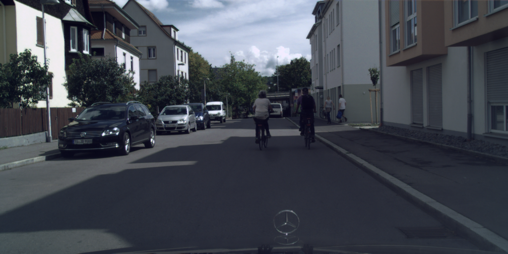
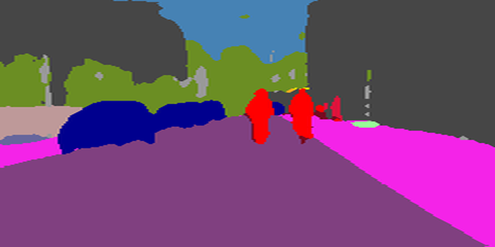
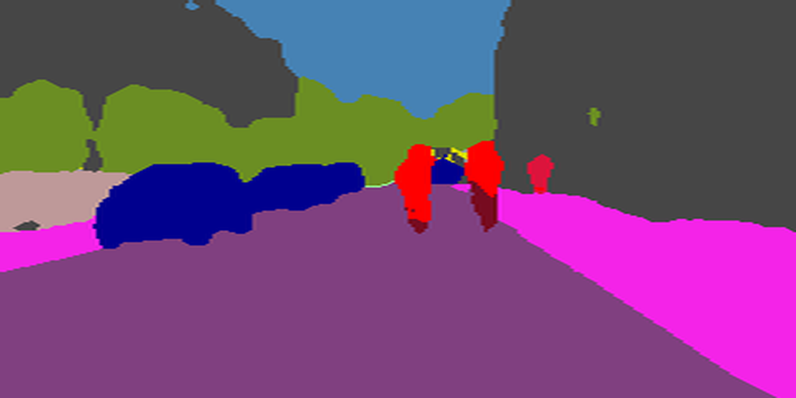

# Accelerating and Pruning CNNs for Semantic Segmentation on FPGA

---

[//]: # (###This repo is a demo of DAC 2022 paper: )

Semantic segmentation is one of the popular tasks in computer vision, providing pixel-wise annotations for scene understanding.
However, segmentation-based convolutional neural networks require tremendous computational power. 
We introduced a fully pipelined FPGA hardware accelerator (based on <cite>[PipeCNN][1]</cite>) with support for dilated convolution, which cuts down the redundant zero multiplications. 
Furthermore, we propose a genetic algorithm based automated channel pruning technique to jointly optimize computational complexity and model accuracy. 
Finally, hardware heuristics and an accurate model of the custom accelerator design enable a hardware-aware pruning framework. 
We achieve 2.44× lower latency with minimal degradation in semantic prediction quality (−1.98 pp lower mean intersection over union) compared to the
baseline DeepLabV3+ model, evaluated on an Arria-10 FPGA. 

| Model      | Unrolling Configuration  Pif , Pof , Pkx | Vanilla (s) | Pruned (s) |
|------------|-------------------------------------------------------------------------------|-----------------|----------------|
| DeepLabV3+ | 16 16 1                                                                       | 3.9             | 2.0            |
|            | 16 32 1                                                                       | 2.5             | 1.4            |
|            | 16 16 4                                                                       | 2.2             | 0.8            |
|            | 16 32 4                                                                       | 1.6             | 0.6            |

    
    <figcaption>Sample image from CityScapes dataset</figcaption>

  

    
     <figcaption>Segmented output from DeepLabV3+ <b>vanilla</b> model on Arria10 FPGA (Latency=1.6 sec, mIOU=67.27%)</figcaption>

    
     <figcaption>Segmented output from DeepLabV3+ <b>pruned</b> model on Arria10 FPGA (Latency=0.6 sec, mIOU=65.29%)</figcaption>

##Requirements

---
 - python 3
 - Intel OpenCL SDK 19.4
 - Intel Arria-10 GX FPGA board

###Preparation

FPGA binary files can be downloaded from [google-drive](https://drive.google.com/drive/folders/10hMgnNJ86kHN9XwR_Kgh511m3JhoE9xo?usp=sharing).
Please place the binary configuration downloaded in the <b>FPGA_binaries</b> folder.

10 Sample images from cityscapes are available in the <b>Quantized_16bit_imgs</b> folder. These images are already downscaled to 960x960 pixels.

Set environment variables for Intel OpenCL SDK.

###Usage
Run `python main.py [OPTIONS]` to run inference of DeepLabV3+ by flashing FPGA binary file.

 `OPTIONS:`

 - `-m, --model` : Specify DeepLabV3+ model, valid options are <b>vanilla</b> or <b>prune</b>. The default is <b>vanilla</b>.
 - `-n, --num_img` : Specify number of images to process. The default is <b>5</b>
 - `-s, --show_seg` : If true, segmented outputs are stored in <b>Segmentation</b> folder. The default is 1.
 - `-u, --unroll_conf` : Specify unrolling configuration to be used. Valid options are <b>16_16_1</b>, <b>16_16_4</b>, <b>16_32_1</b> and <b>16_32_4</b>. The default is <b>16_32_4</b>.

[//]: # (##Citation)
---

[1]: https://arxiv.org/abs/1611.02450
